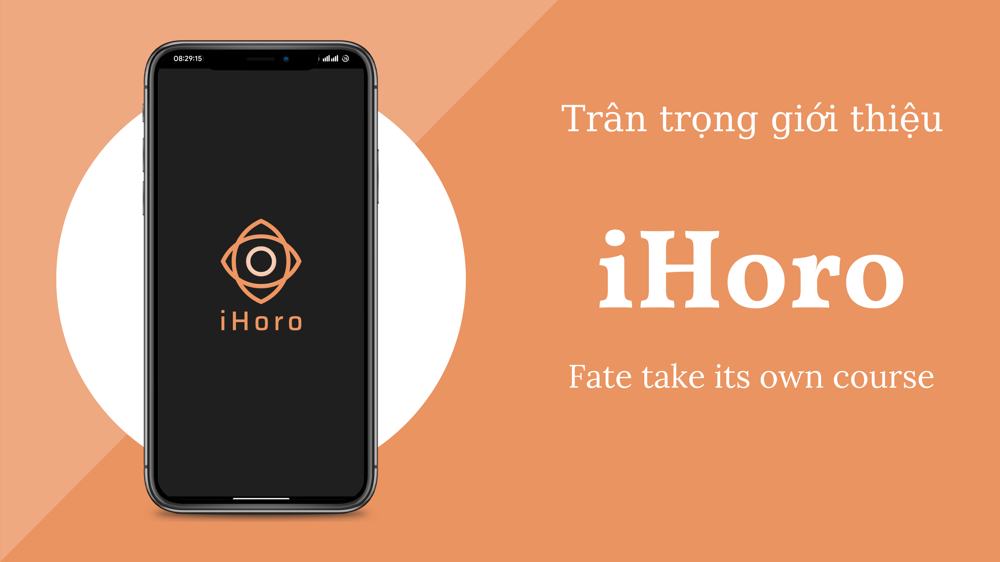
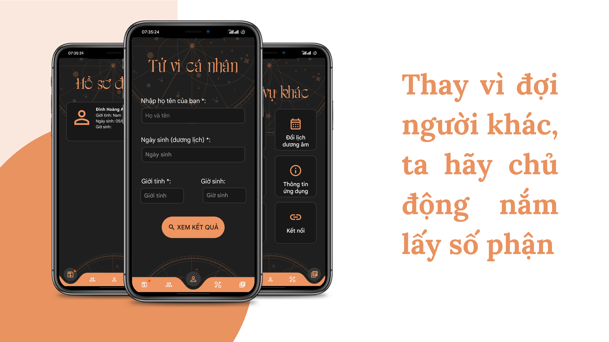
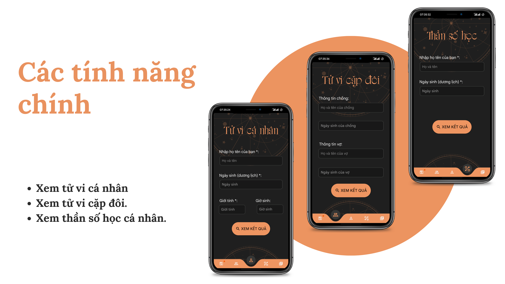
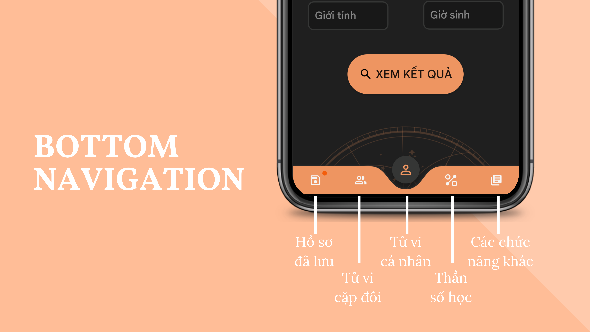
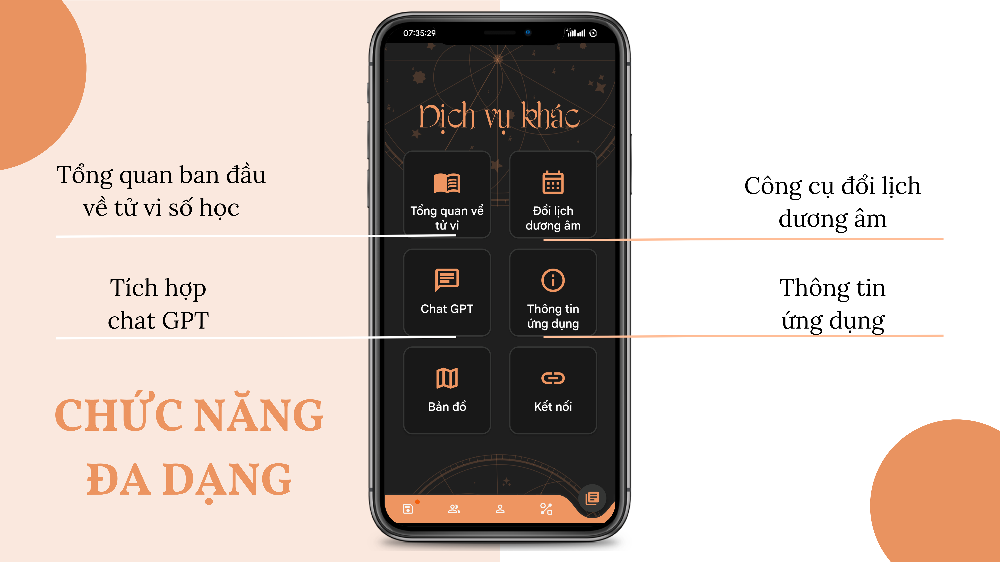
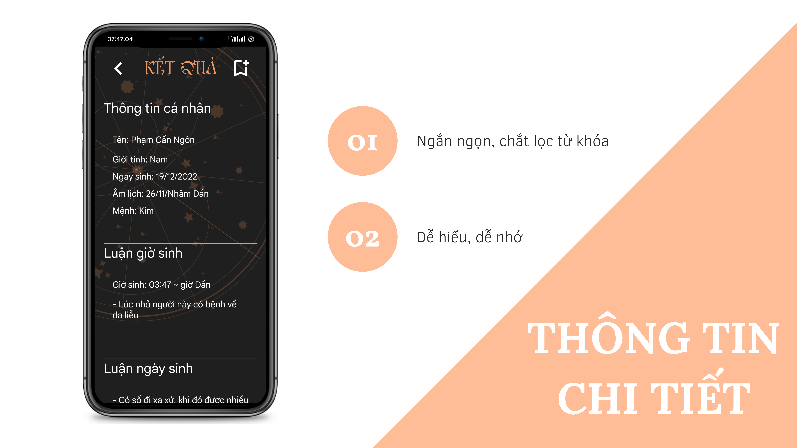
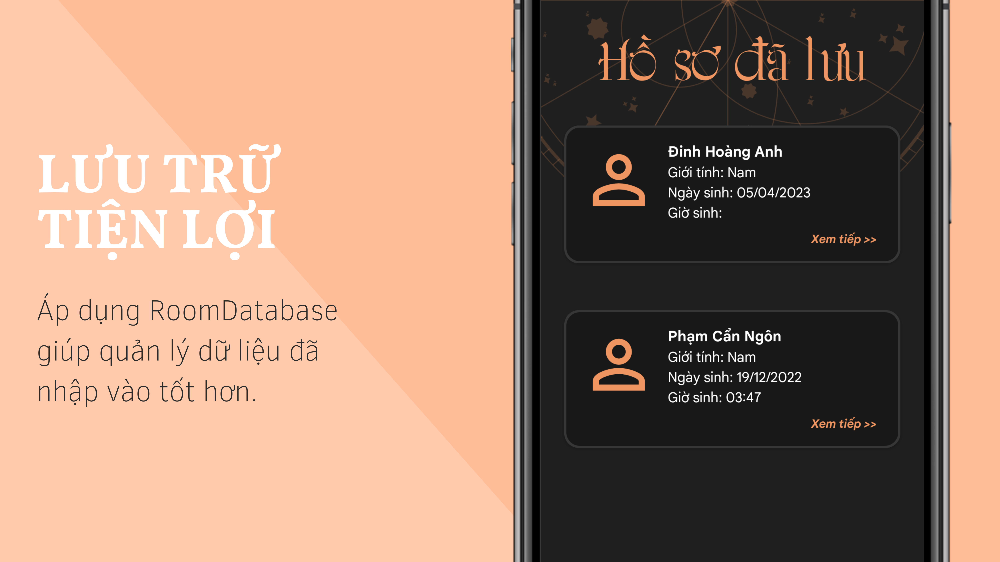

# P-Connect

## Tác giả / Author

* Nickken

## Mô tả sản phẩm / Description

> Tiếng Việt
* iHoro là sản phẩm Android được viết bằng ngôn ngữ Java, được phát triển bởi Nickken, được phát triển trong suốt thời gian 1 tháng trong cuộc thi ProGApp. iHoro là ứng dụng giúp người dùng có thể xem được các thông tin về tử vi, thần số học và có những lời khuyên đúng lúc và đúng thời điểm. Phong cách đen và cam phối hợp tạo không khí thần bí nhưng tràn đầy năng lượng. Thiết kế UI tối giản, bắt mắt, thân thiện người dùng.
> English
* iHoro is an Android product written in Java language, developed by Nickken, developed throughout the 1-month ProGApp competition. iHoro is an application that helps users view information about horoscopes, numerology and have the right advice at the right time. The black and orange style combines to create a mysterious atmosphere but full of energy. Simple UI design, eye-catching, user-friendly.

### Yêu cầu / Prerequisites

> Tiếng Việt
* Để chạy ứng dụng này, bạn cần thiết bị hỗ trợ java. 
* MinSDK 29 - TargetSDK 33
* Cài đặt java 11 bằng các lệnh:
`sudo apt update`
`sudo apt install openjdk-11-jre-headless`
* Cài đặt android-studio
`sudo snap install android-studio --classic`
> English
* To run this application, you need a device that supports java.
* MinSDK 29 - TargetSDK 33
* Install java 11 using the commands:
`sudo apt update`
`sudo apt install openjdk-11-jre-headless`
* Install android-studio
`sudo snap install android-studio --classic`


### Cài đặt / Setup

* Clone the project
* Open in android-studio


## Công nghệ sử dụng / Technologies

* Java (version 11)
* Android 
* Gradle (7.4.2)


## Demo image







## License Information

* This software is licensed under MIT License.
* [Read More](https://choosealicense.com/licenses/mit/) on the license.


```
MIT License

Copyright (c) 2023 NickKen

Permission is hereby granted, free of charge, to any person obtaining a copy
of this software and associated documentation files (the "Software"), to deal
in the Software without restriction, including without limitation the rights
to use, copy, modify, merge, publish, distribute, sublicense, and/or sell
copies of the Software, and to permit persons to whom the Software is
furnished to do so, subject to the following conditions:

The above copyright notice and this permission notice shall be included in all
copies or substantial portions of the Software.

THE SOFTWARE IS PROVIDED "AS IS", WITHOUT WARRANTY OF ANY KIND, EXPRESS OR
IMPLIED, INCLUDING BUT NOT LIMITED TO THE WARRANTIES OF MERCHANTABILITY,
FITNESS FOR A PARTICULAR PURPOSE AND NONINFRINGEMENT. IN NO EVENT SHALL THE
AUTHORS OR COPYRIGHT HOLDERS BE LIABLE FOR ANY CLAIM, DAMAGES OR OTHER
LIABILITY, WHETHER IN AN ACTION OF CONTRACT, TORT OR OTHERWISE, ARISING FROM,
OUT OF OR IN CONNECTION WITH THE SOFTWARE OR THE USE OR OTHER DEALINGS IN THE
SOFTWARE.
```